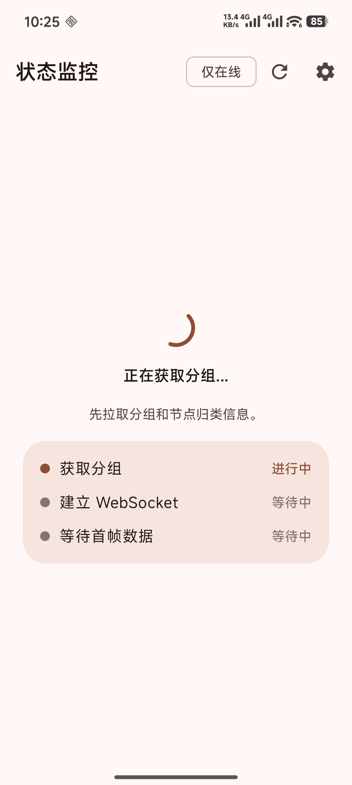
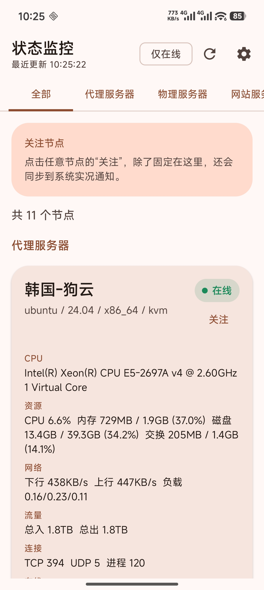
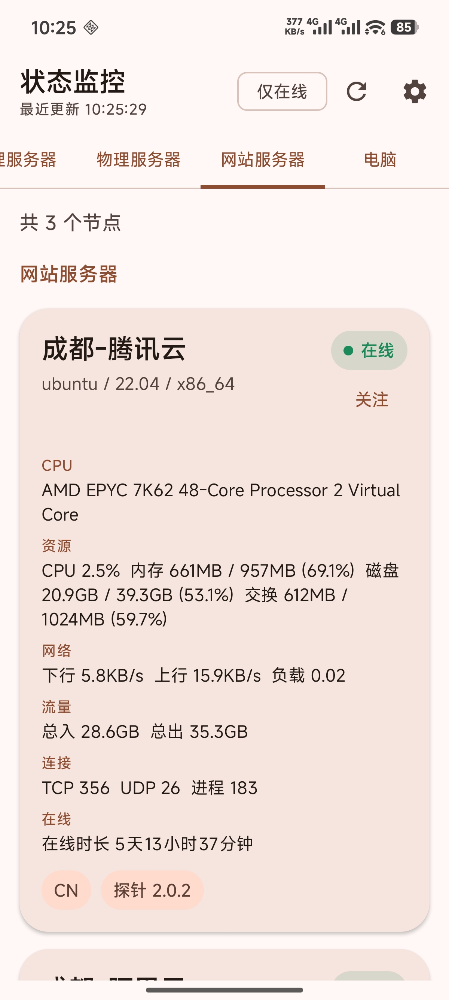
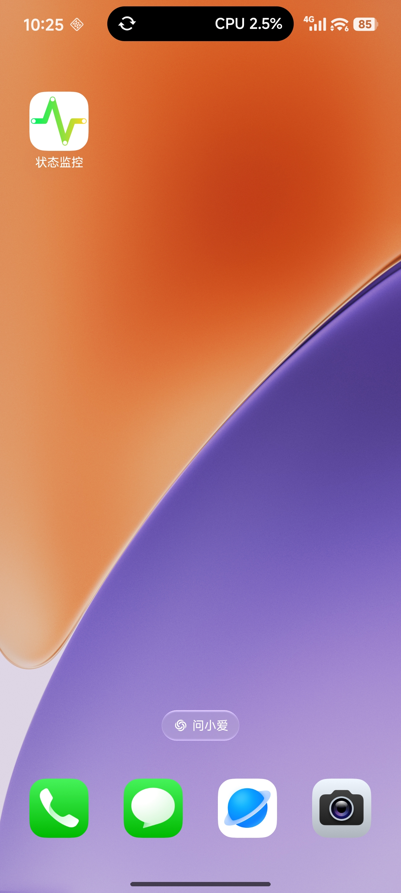
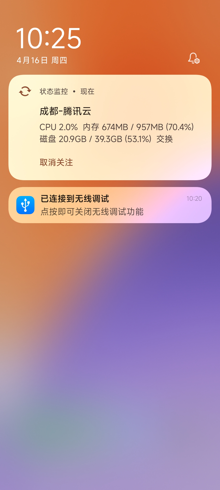
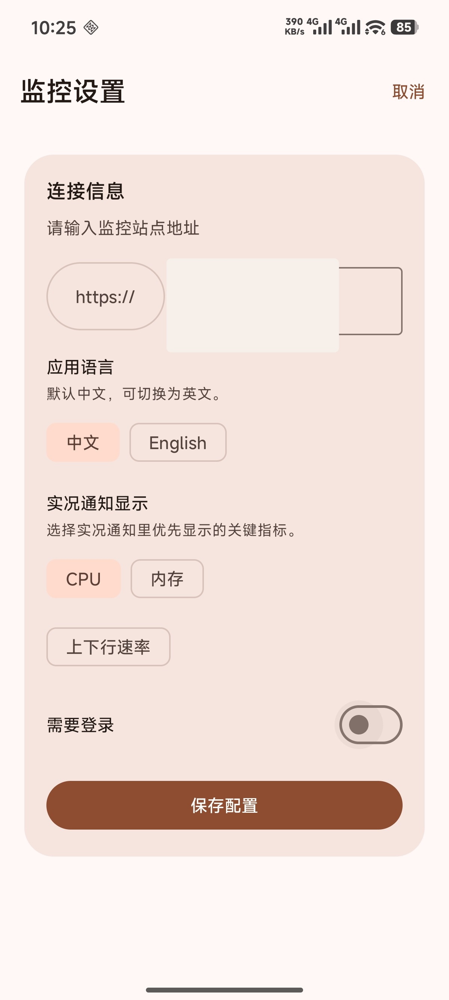
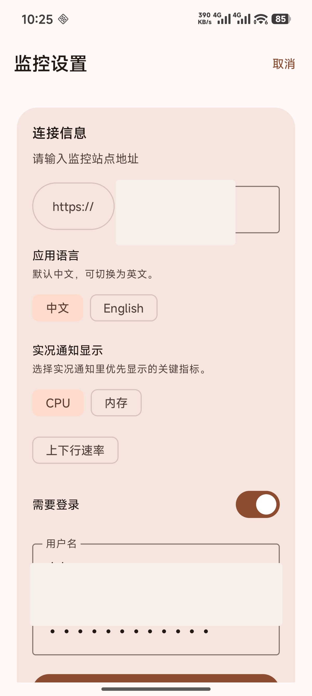

# 哪吒状态监控 / Nezha Monitor Android

一个基于 [Nezha Monitoring](https://github.com/nezhahq/nezha) 面板接口开发的 Android 手机端客户端，用来在手机上查看服务器在线状态、资源占用、网络流量与分组信息，并通过系统常驻通知持续跟踪关注节点。

这个项目是面向手机端的第三方客户端，不是哪吒面板本体，也不隶属于哪吒监控官方项目组。

## 功能特性

- 基于哪吒面板接口获取节点状态，并通过 WebSocket 订阅实时数据
- 支持节点分组展示、全部节点视图、仅在线筛选
- 支持关注单个节点，并在系统通知中持续显示该节点的最新状态
- 支持需要登录的面板，自动调用 `/api/v1/login` 获取 `nz-jwt`
- 自动适配 `http/https` 到 `ws/wss`
- 支持中英文界面切换
- 支持展示 CPU、内存、磁盘、流量、连接数、IP、套餐和账单等信息

## 当前接入的接口

应用当前围绕哪吒面板以下接口工作：

- `/api/v1/login`
- `/api/v1/server-group`
- `/api/v1/ws/server`

如果你的部署、反代或鉴权方式修改了这些接口行为，需要按实际情况调整代码。

## 运行要求

- Android Studio
- Android SDK 36
- JDK 17 或更高版本
- Android 12 及以上设备

当前项目配置：

- `compileSdk = 36`
- `targetSdk = 36`
- `minSdk = 31`

## 本地构建

### 使用 Android Studio

1. 克隆仓库
2. 用 Android Studio 打开项目根目录
3. 等待 Gradle 同步完成
4. 运行 `app` 模块到真机或模拟器

### 使用命令行

Windows:

```powershell
.\gradlew.bat assembleDebug
```

macOS / Linux:

```bash
./gradlew assembleDebug
```

调试包输出位置：

```text
app/build/outputs/apk/debug/
```

## 使用说明

首次启动后，在设置页填写你的监控地址。

- 可以直接填写面板站点地址，例如 `https://your-nezha.example.com`
- 如果面板需要登录，打开“需要登录”并填写用户名和密码
- 应用会自动拼接并请求对应的 API 与 WebSocket 地址
- 关注某个节点后，应用会启动前台服务，在系统通知里持续更新该节点状态

## 界面预览

<p align="center">
  
  
</p>

<p align="center">
  
  
</p>

<p align="center">
  
</p>

<p align="center">
  
  
</p>

## 项目结构

```text
app/src/main/java/com/atigger/status/
├── MainActivity.kt
├── ServerLiveUpdateService.kt
├── LiveUpdateActionReceiver.kt
├── data/
├── i18n/
└── ui/
```

## 与上游项目的关系

本项目的功能实现建立在哪吒面板现有接口与数据结构之上，灵感和兼容目标来源于上游项目：

- 上游项目: [nezhahq/nezha](https://github.com/nezhahq/nezha)

如果你在使用过程中发现接口兼容问题，优先检查你所使用的哪吒版本、反向代理配置，以及是否对默认 API 做过二次修改。

## 开源协议

本项目沿用上游 [nezhahq/nezha](https://github.com/nezhahq/nezha) 的开源协议，采用 Apache License 2.0，详见 [LICENSE](./LICENSE)。

## 免责声明

- 本项目为个人维护的第三方 Android 客户端
- 本项目不保证兼容所有魔改版、二开版或历史版本哪吒面板
- 因配置错误、反代设置、接口变更导致的连接失败，需要按实际部署环境自行排查
